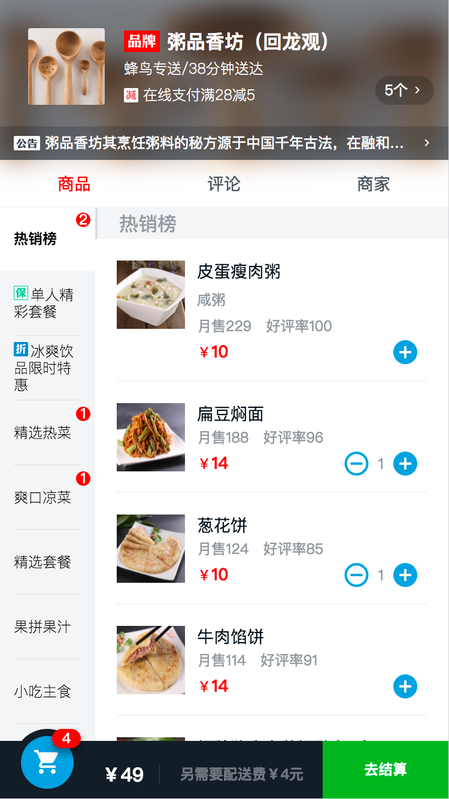
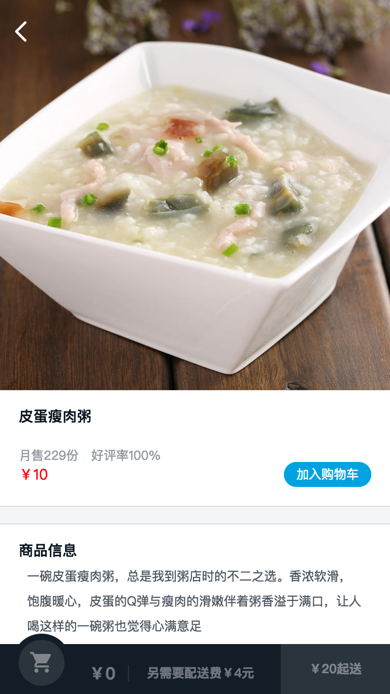
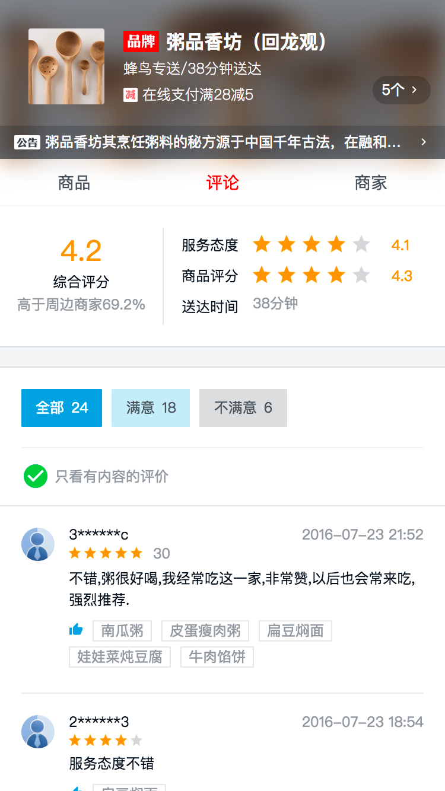
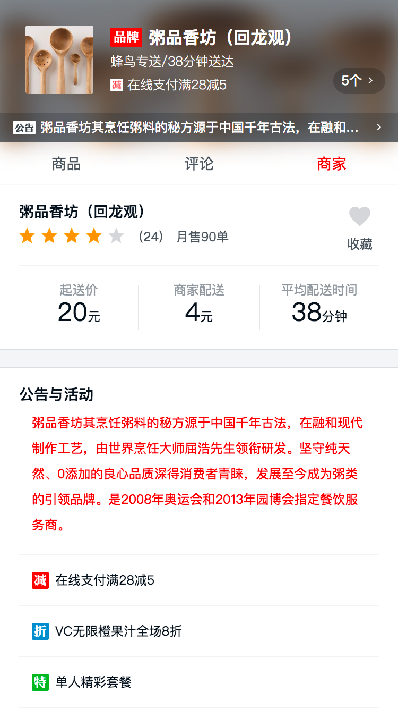

# 学习Vue高仿饿了么点餐系统

> stylus、webpack、vue2.0、vue-router、vue-resource、better-scroll

## 演示

<a href="" target="_blank">点击演示戳我</a>（请使用chrome开发者手机演示模式预览）

### 移动端演示

扫二维码在手机上查看效果更好


## 安装步骤

```bash
# install dependencies
npm install

#serve with hot reload at localhost:8080
npm run dev

# build for production widh minification
npm run build
```
## 项目截图

<div style="font-size:0">
    
    
    
    
</div>

## 页面与组件关系


## 总结一下

采用vue-cli来构建

### css方面
- iconfont图标字体
- flex弹性布局
- 移动端1px边框实现
- css sticky footer布局（头部弹窗页面中应用）
- 媒体查询media特殊处理小屏幕手机

### js方面

- 列表滚动联动
- 小球飞入动画（vue的父子组件通讯、贝塞尔曲线）
- vue的自定义过滤器(用于日期时间)
- 数据存取localStorag
- express实现mock模拟后台数据
- vue组件缓存，防止多次发ajax的keep-alive

### 实现

#### 列表滚动联动

滑动右侧，左侧对应

1. 先用better-scroll插件创建滚动，参数probeType：3，表示后续可以通过scroll拿到坐标
2. 监听scroll事件，在data中建立一个scrollY，用来存放当前的坐标位置
3. 通过$refs拿到外层ul的dom元素,然后创建一个数组，数组中存放每一块li对应的高度clientHeight,第一个li为0
4. vue的computed计算,根据当前scrollY的值与数组中的比较(>=当前 and <当前+1)，在范围内返回对应的index
5. 利用index，通过vue的class绑定显示对应的效果

点击左侧，右侧对应

1. 通过scrollToElement到某一个元素即可

#### 小球飞入

1. 父子组件的通讯,获取购买加减组件的dom,通过this.$emit(属性,event.target),把target传入购物车组件
2. balls数组中存放5个球，dropBalls用来存放下落中的小球
3. 先找到一个隐藏的小球,让它显示并把对应的dom元素也存入，并把该球添加到dropBalls中
3. transition的钩子实现动画，用到before-enter、enter、after-enter
4. 在before-enter中，找到所有显示的小球，根据balls的dom元素getBoundingClientRect计算left值和top值，然后用translate3d偏移，外层元素为Y轴变化，里层元素为X轴变化
5. 在enter中，触发重绘offsetHieght，然后恢复默认值，translate3d设为0
6. after-enter时，根据shift取出dropBalls的小球，把这个球设置为false，即不显示，对应的dom元素设置成none;
7. 以上为直线的运动效果，若要小球飞入，用到css3属性贝塞尔曲线，外层的dom在Y轴方向用<a src="http://cubic-bezier.com/#0,0,1,1" traget="_blank">贝塞尔曲线</a>cubic-bezier(0.49, -0.29, 0.75, 0.41)，里层的dom在X轴方向普通linear，速度为400ms,这样可以保证我们足够点击多次

#### 实景图左右滑动
1. 通过better-scroll实现
2. 计算内层的宽度
3. scrollX：true横向滚动,eventPassthrough:'vertical'当横向滚动的时候忽略垂直方向的滚动
4. mounted和watch都需要调用,数据通过`<router-view></router-view>`传进来是一个异步的过程，当mouted时候数据没有，所以要监视数据的改变，这里需要用到watch,而在tab之前的切换的时候，没有加载过的是会触发mouted的（keep-alive），这里watch不会执行。

# vue知识点
1. vue-router、vue-resource
2. 父子组件之间的通信
3. data(){ return{} }，必须是函数，当data中数据不存在，用Vue.set(this.xxx,key,value)
4. 获取dom, this.$refs.dom
5. this.nextTick(()=>{}),执行这个dom更新
4. 生命周期用到created、mounted
5. props:{}，添加验证
7. methods:{}、computed:{}
8. watch:{'seller'(){}}
9. 动画`<transition></transition>`,css实现的动画，js钩子实现动画
10. 防止来次发ajax`<keep-alive></keep-alive>`

